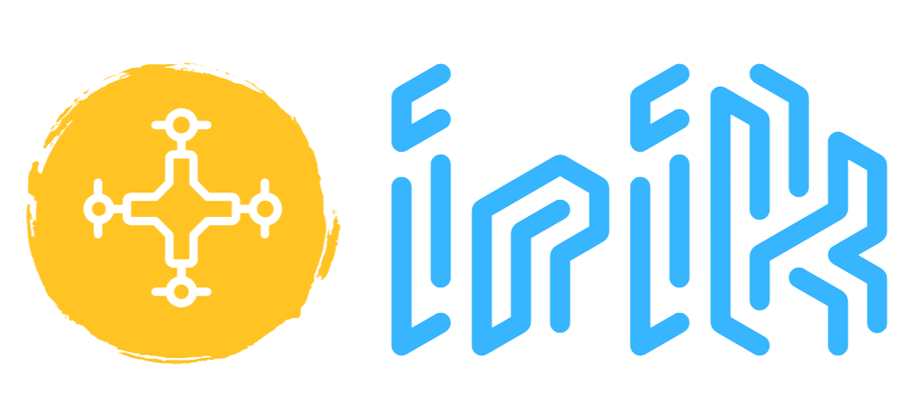
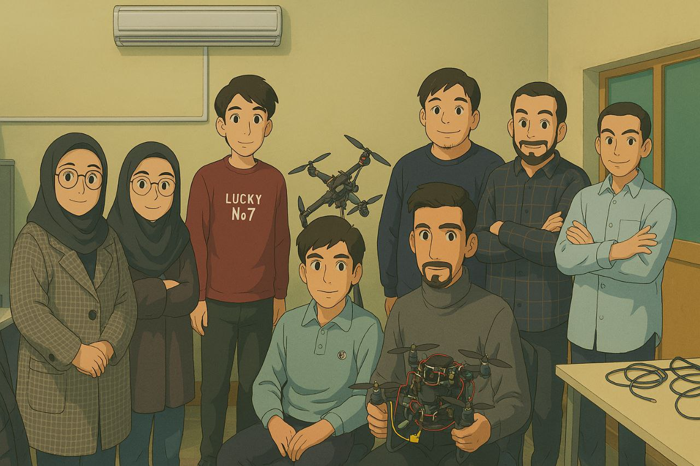

# Drone Control Algorithms

<p align="center">
    
</p>

ROS2 Python package for autonomous drone control algorithms, designed to work with PX4 and Gazebo simulation.

## Project Timeline
20-day development sprint for complete autonomous drone control system.

## Features
- ✅ Basic flight control (takeoff, landing, hover)
- ✅ PID controllers for position/attitude control
- ✅ Safety systems and failsafe handling
- ✅ Waypoint navigation
- ✅ Path planning algorithms (A*, RRT)
- ✅ Obstacle avoidance
- ✅ MAVLink-ROS2 integration
- ✅ Telemetry and monitoring

## Quick Start

### Prerequisites
- ROS2 Humble/Iron
- Python 3.8+
- PX4-Autopilot (for simulation interface)

### Installation
```bash
# Clone repository
git clone https://github.com/your-username/drone-control-algorithms.git
cd drone-control-algorithms

# Install dependencies
pip install -r requirements.txt

# Build ROS2 package
colcon build
source install/setup.bash
```

## Team Members
- **Member 1**: Zahra Ayed
- **Member 2**: Reyhaneh Fathollahi
- **Member 3**: Mohammad javad Shadpoor
- **Member 4**: Mohammad hosseyn Lotfi
- **Member 5**: Mahdi Gholami
- **Member 6**: Arshia Yarmohammadi
- **Member 7**: Ali Naserinia
- **Member 8**: Mohammad bagher Mohsenian
- **Member 9**: Leyla Shekari
<p align="center">
    
</p>